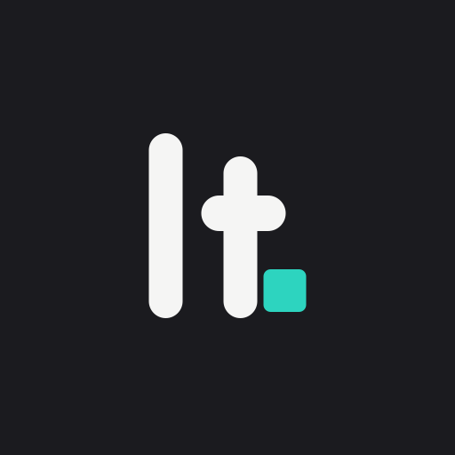
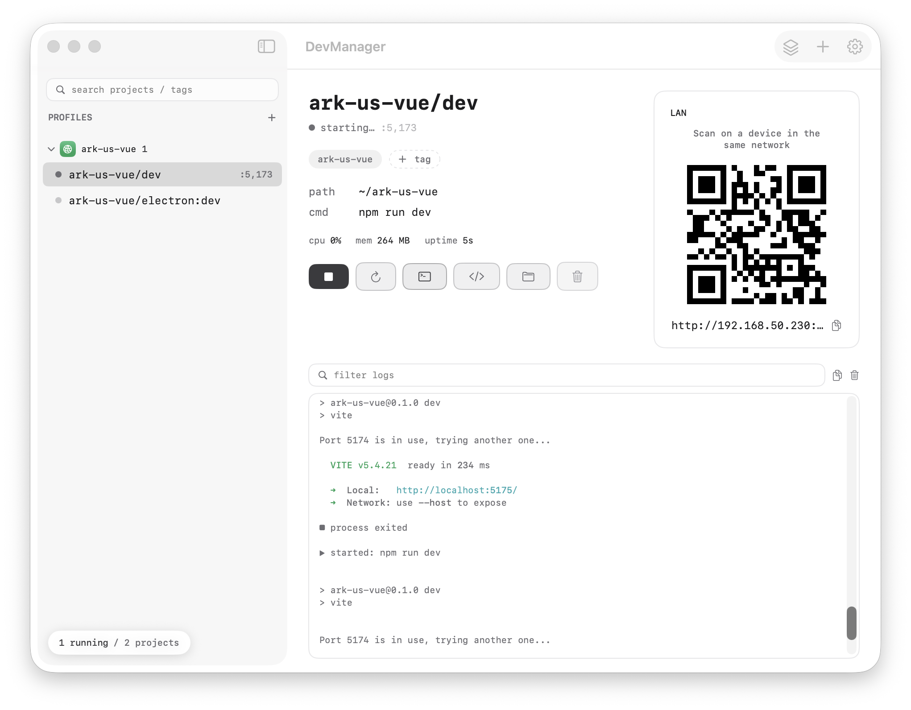
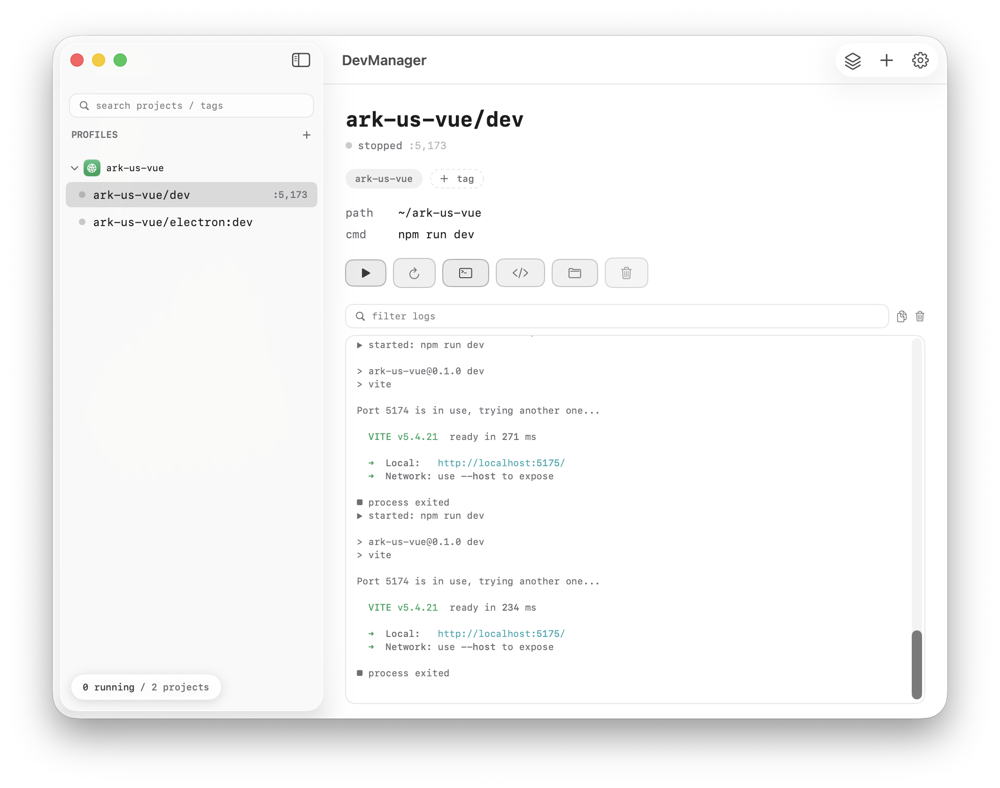
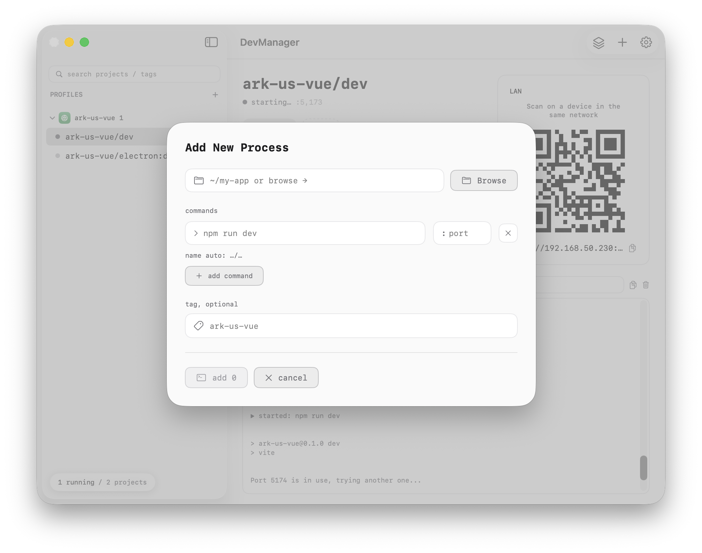
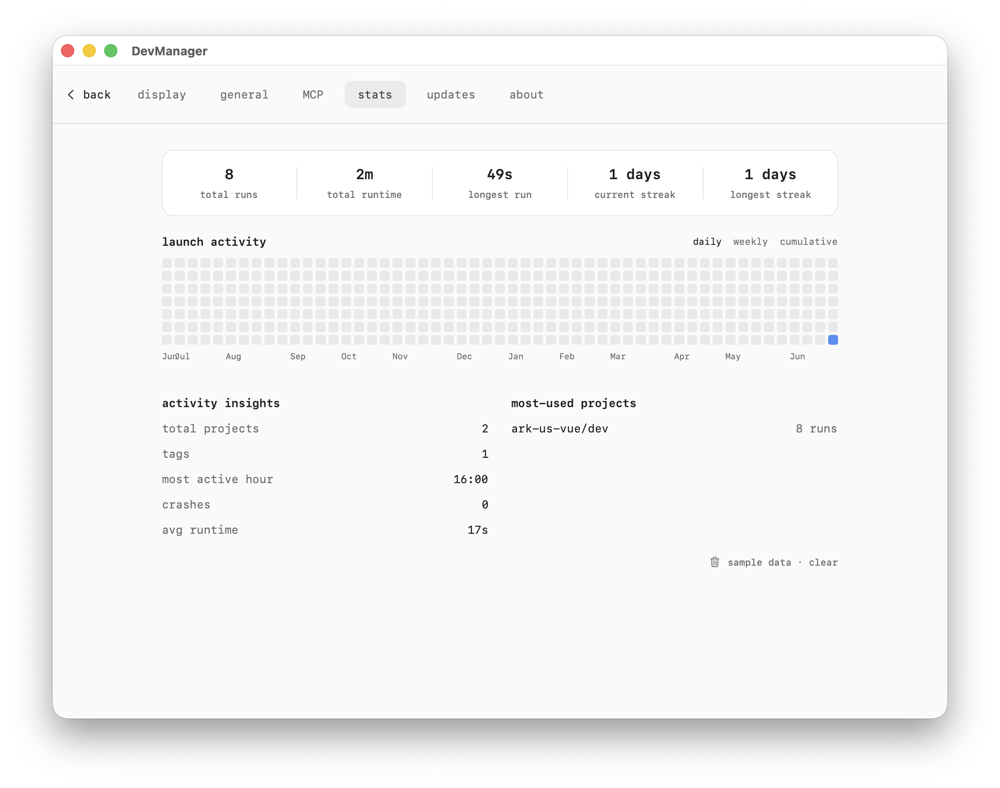
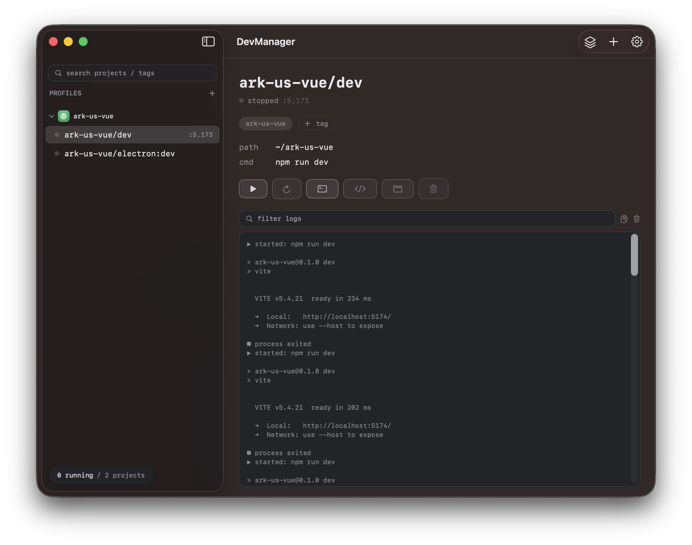
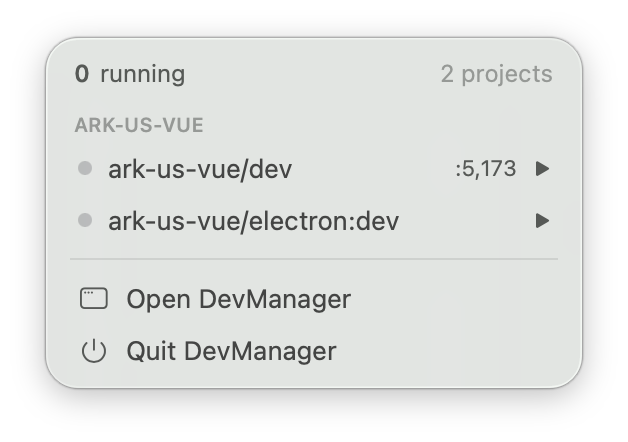

<p align="center">
  
</p>

<h1 align="center">DevManager</h1>

<p align="center">
  A native macOS local dev-process manager — start, watch, and organize<br/>
  all your local dev servers from one screen.
</p>

<p align="center">
  
  
  
  
</p>

<p align="center">
  
</p>

<p align="center"><b>English</b> · <a href="#中文">中文</a> · by <a href="https://labtool">labtool</a></p>

---

## Why

Running local dev servers gets messy fast: six terminal tabs, you forget which one is
still up, a port clashes and you don't know who took it. **DevManager** is the single
control room — every project in one list, one click to start/stop, live logs and metrics
in view, and an AI can even drive it for you.

## Features

- **Dual form factor** — a menu-bar resident (`MenuBarExtra`) and a full window
  (`NavigationSplitView`) share one `ProcessManager`; start/stop in either place syncs instantly.
- **Real process management** — spawns commands through a login shell (`/bin/zsh -lc`) so it
  inherits your `PATH` / nvm / conda; captures stdout+stderr as a live log stream.
- **Projects & start-profiles** — a *New Process* sheet (folder + browse, multiple commands,
  port, tag, auto name); group by tag; save named **start-profiles** to launch a whole set in order.
- **Port-ready detection** — polls `127.0.0.1:port` and parses the real URL from logs. Status dot:
  grey = stopped · **amber = up but port not ready** (still compiling) · green = actually serving.
  Click the port to open it. **Conflict-aware** — it identifies the occupier (this app's project vs
  an external process) and never blind-kills.
- **Colored live logs** — ANSI color rendering, filter/search, copy, clear, on-disk persistence.
- **Process metrics** — per-project CPU / memory / uptime, summed across the whole tree (zsh → npm → node).
- **LAN QR code** — scan from a phone on the same Wi‑Fi to open the dev URL on device.
- **⌘K quick-launch** palette + a global hotkey; **crash / ready notifications**.
- **Usage stats** — a GitHub-style launch-activity heatmap and per-project insights.
- **Neutral-gray theme** that follows system light / dark automatically. No terminal-green.
- **MCP integration** — let Claude Code / Codex / Cursor list, start, stop, restart, create and
  delete projects, read logs, and run start-profiles.
- **Auto-update** via [Sparkle](https://sparkle-project.org) (EdDSA-signed appcast).

## Screenshots

<table>
  <tr>
    <td width="50%"><br/><sub><b>Sidebar & start-profiles</b> — every project in one list, grouped by tag.</sub></td>
    <td width="50%"><br/><sub><b>New process</b> — folder + command, port, tag; one folder → many commands.</sub></td>
  </tr>
  <tr>
    <td width="50%"><br/><sub><b>Usage stats</b> — launch-activity heatmap + insights.</sub></td>
    <td width="50%"><br/><sub><b>Dark mode</b> — follows the system automatically.</sub></td>
  </tr>
  <tr>
    <td width="50%"><br/><sub><b>Menu bar</b> — start/stop without opening the window.</sub></td>
    <td width="50%" valign="top"><br/><sub>Neutral-gray tokens in <code>DesignSystem/Theme.swift</code>; mint <code>#2DD4BF</code> is the only accent — reserved for state, highlights and data.</sub></td>
  </tr>
</table>

## MCP — let AI drive your processes

DevManager runs a loopback-only control server (`127.0.0.1:39125`). The published
[`@labtool/devmanager-mcp`](https://www.npmjs.com/package/@labtool/devmanager-mcp) bridge
exposes it as MCP tools over stdio. Keep DevManager running, then register the bridge:

```bash
# Claude Code
claude mcp add -s user devmanager -- npx --prefer-offline @labtool/devmanager-mcp@latest
# Codex
codex  mcp add devmanager -- npx --prefer-offline @labtool/devmanager-mcp@latest
```

Tools: `list_projects` · `start_project` · `stop_project` · `restart_project` ·
`create_project` · `delete_project` · `get_logs` · `list_profiles` · `start_profile`.

The bridge source lives in [`mcp/`](mcp/) (MIT).

## Requirements

- macOS 14.0+
- Xcode 26 / Swift toolchain (built in Swift 5 language mode)
- [XcodeGen](https://github.com/yonaskolb/XcodeGen) — `brew install xcodegen`

## Build & run

The Xcode project is generated from `project.yml` by XcodeGen (`.xcodeproj` is **not** committed):

```bash
brew install xcodegen        # once
xcodegen generate            # after editing project.yml or adding files
open DevManager.xcodeproj
```

Command-line build:

```bash
xcodebuild -project DevManager.xcodeproj -scheme DevManager -configuration Debug build
```

The app is **not sandboxed** — a process manager needs to spawn arbitrary dev commands and run `ps` / socket probes.

## Signing & notarization (for distribution)

Distribution builds are Developer ID signed + notarized. The real `scripts/release.sh` and
`scripts/ExportOptions.plist` are git-ignored (they hold your own signing details); copy the
committed templates and fill in your values:

```bash
cp scripts/release.example.sh       scripts/release.sh
cp scripts/ExportOptions.example.plist scripts/ExportOptions.plist
# then set TEAM_ID / FEED_BASE_URL in release.sh (or via env vars)
```

Steps:

1. A **Developer ID Application** certificate in your Keychain.
2. Store a notary profile once, then `release.sh` reuses it:

   ```bash
   xcrun notarytool store-credentials devmanager-notary \
     --apple-id "<your-apple-id>" --team-id "<YOUR_TEAM_ID>" \
     --password "<app-specific password from appleid.apple.com>"
   ```

`SUPublicEDKey` (Sparkle) and `MARKETING_VERSION` live in `project.yml`; the release
pipeline archives → exports Developer ID → notarizes → staples → builds the appcast.

## Tech stack

SwiftUI · `@Observable` / `@MainActor` · `Foundation.Process` · `Network.framework`
(control server) · Carbon `RegisterEventHotKey` (global hotkey) · CoreImage (QR) ·
UserNotifications · SMAppService (launch at login) · Sparkle (updates) · MCP SDK (Node bridge).

## Project layout

```
DevManager/         SwiftUI app source (Core / Main / DesignSystem)
project.yml         XcodeGen spec (generates DevManager.xcodeproj)
mcp/                Node MCP bridge — @labtool/devmanager-mcp (MIT)
brand/              logo, product screenshots, promo hero images
scripts/            release / notarization / appcast pipeline
videos/             HyperFrames promo-video projects (CN / EN, reproducible)
```

## License

[MIT](LICENSE) © [labtool](https://labtool). The `mcp/` bridge is MIT too
(see [`mcp/LICENSE`](mcp/LICENSE)).

---

<a name="中文"></a>

## 中文

**DevManager** 是一款原生 macOS（SwiftUI）本地 dev 进程管理器 —— 一屏管好所有本地服务：
启停、彩色实时日志、CPU/内存/运行时长、端口就绪与冲突识别、局域网扫码、⌘K 快启、
菜单栏常驻、启动热力图、深浅色自动、Sparkle 自动更新,还能让 AI 通过 MCP 直接管进程。

**主要功能**

- **双形态** — 菜单栏常驻 + 主窗口,共享一个 `ProcessManager`,两边启停实时同步。
- **真实进程管理** — 用登录 shell（`/bin/zsh -lc`）启动,继承 `PATH`/nvm/conda,捕获实时日志。
- **项目 & 启动组合** — 新建进程（目录+命令+端口+tag,一个目录多命令）;按 tag 分组;
  保存**启动组合**一键按序起一整组。
- **端口就绪识别** — 探测端口 + 从日志解析真实 URL;灰=已停 · **黄=进程起了但端口未就绪** · 绿=真正在服务。
  **冲突识别**:能分辨占用者是本 app 的项目还是外部进程,绝不盲杀。
- **彩色日志** · **CPU/内存/运行时长** · **局域网二维码扫码** · **⌘K 快启 + 全局热键** ·
  **崩溃/就绪通知** · **启动热力图** · **深浅色自动** · **Sparkle 更新**。
- **MCP 接入** — 让 Claude Code / Codex / Cursor 直接 列/启/停/重启/新建/删除 项目、看日志、跑组合。

**构建**（`.xcodeproj` 由 XcodeGen 从 `project.yml` 生成,不入库）:

```bash
brew install xcodegen && xcodegen generate && open DevManager.xcodeproj
```

**MCP 接入**（保持 DevManager 运行）:

```bash
claude mcp add -s user devmanager -- npx --prefer-offline @labtool/devmanager-mcp@latest
```

截图与功能详见上方英文小节(界面为中/英双语,跟随系统或手动切换)。

<p align="center"><sub>Made by <a href="https://labtool">labtool</a></sub></p>
